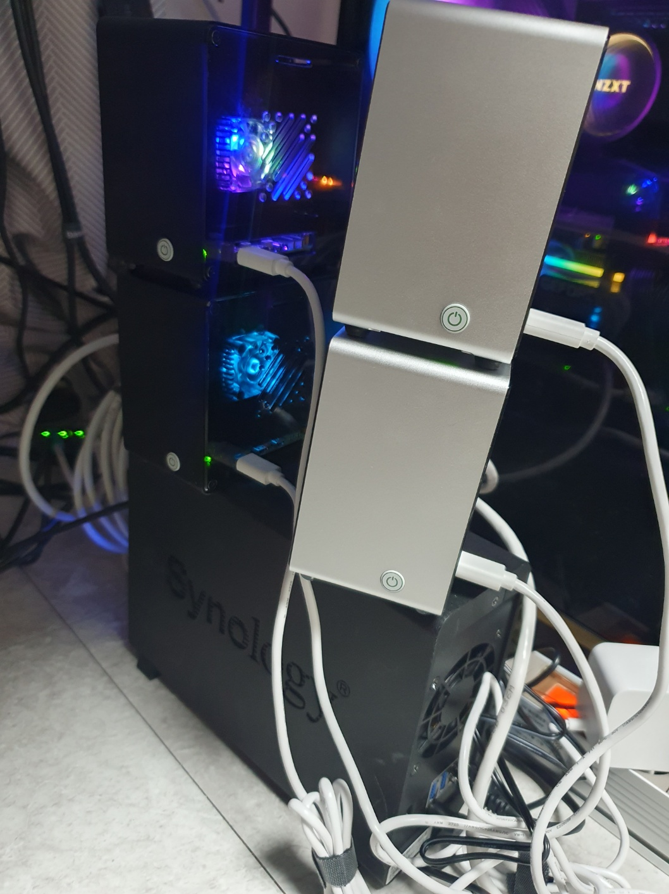
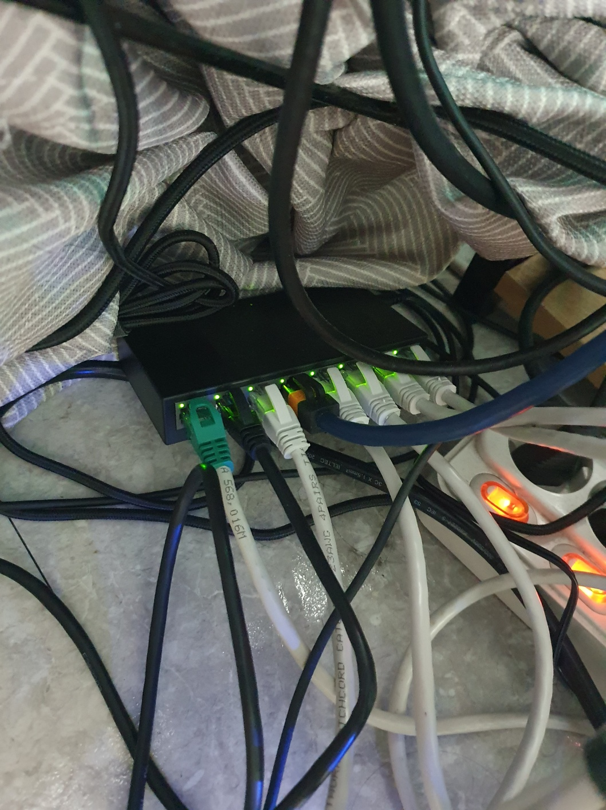

# 백만원으로 나만의 프라이빗 클라우드 만들기

## 들어가며
- AWS EKS등과 같이 클라우드환경에서 k8s 클러스터를 구축해서 개발을 하기에는 발생하는 비용을 개인이 감당하기 쉽지않다고 판단하여, 자체 서버를 집에서 구축하게 되었습니다.
- 오랜기간동안 딱히 관심을 두지 않았던 라즈베리파이가 지속적으로 업그레이드되면서, 5버전대의 성능이 가격대비 서버로서 가치가 높다는 생각이 들었습니다.
- 대략적으로 3개에서 5개 노드로 구성한다고 했을 때, 약 100만원 전후의 비용을 투자하면 제가 거주하고 있는 집에 k3s(k8s의 경량화된 버전) 클러스터를 구축할 수 있겠다는 판단을 하였습니다.

### 대략적인 구매 견적
* 대략적인 가격이라 오차가 있습니다.

| 장비      | 구매가              | 수량 | 설명 |
| :-------- | :---------------- | :----- | :----- |
| `중고랩탑`      | 미구매 | 1 | 4코어 8기가 메모리 |
| `라즈베리파이5 본체` | 110,000     | 4 | 각 4코어 8기가 메모리 |
| `라즈베리파이5 어댑터`      | 20,000 | 4 | 전원공급 |
| `라즈베리파이5 케이스`      | 20,000 | 4 | 쿨러용 |
| `USB 3.0 메모리 16GB`      | 30,000 | 3 | 라즈베리파이 부팅용 |
| `USB 2.0 메모리 16GB`      | 미구매 | 1 | 라즈베리파이 부팅용 |
| `NAS (4TB HDD포함)`      | 400,000 | 1 | k3s (NFS) storageclass 용 |
| `스위칭허브 8포트`      | 30,000 | 1 | 클러스터 네트워킹용 |
| `랜선`      | 2,500 | 6 | 클러스터 네트워킹용 + 여분 |
| `알루미늄 멀티탭 8구`      | 30,000 | 1 | 전원공급용 |

### 라즈베리파이5 4개와 중고랩탑 1개를 합쳐서 총 5개 노드로 서버 구축


### 원룸 공유기가 라우터라 스위칭 허브만 추가 구매


## 무엇이 필요했나
아래와 같은 여러 지식과 경험들이 필요했습니다.

### 리눅스
- 패키지 매니저를 다뤄봤으면 좋습니다.
- 시스템 유저 생성 및 권한 부여경험이 있으면 좋습니다.
- 도커 컨테이너를 다뤄본 경험이 있으면 좋습니다.

### 네트워크
- 프라이빗과 퍼블릭 네트워크를 구분할 줄 알면 좋습니다.
- 방화벽 설정경험이 있으면 좋습니다.
- 포트포워딩 설정경험이 있으면 좋습니다.

### 스토리지
- 마운트 경험이 있으면 좋습니다.
- NAS에 대한 직간접적인 사용 및 설정경험이 있으면 좋습니다.
- k8s 오브젝트를 다뤄본 경험이 있으면 좋습니다.

### 쿠버네티스
- 컨테이너 빌드, 배포, k8s 오브젝트를 다뤄본 경험이 있으면 좋습니다.
- kubectl 및 helm cli 사용경험이 있으면 좋습니다.
- 각종 설정 및 manifest file을 다뤄본 경험이 있으면 좋습니다.
- 로그 및 리소스 모니터링경험이 있으면 좋습니다.

## 막히는 부분은 없었나
### cgroup 메모리 설정
- 라즈베리파이5 각 서버에서 /boot/firmware/cmdline.txt에 아래의 내용을 추가할 때, 신규라인에 추가한게 문제가 됬습니다.
- 신규라인에 추가하면 k3s 설치시, cgroup을 찾을 수 없는 에러가 발생했습니다. 신규라인이 아닌 맨 뒤에 추가하면, 에러가 발생하지 않았습니다.

```
cgroup_memory=1 cgroup_enable=memory
```

## 그럼, 구축은 어떻게 했나
### 1. 각 USB 메모리에 라즈베리파이5 이미지저로 64비트 OS를 설치
- https://www.raspberrypi.com/software/


### 2. 각 라즈베리파이5를 부팅하고 유선네트워크 연결

### 3. 중고랩탑에는 k3s master 설치
#### docker install
```
~$ sudo apt install docker.io
```

#### k3s install
```
~$ sudo curl -sfL https://get.k3s.io | sh -
```

#### hostname setting
```
~$ sudo hostnamectl set-hostname "k3s-master"
~$ sudo nano /etc/hosts
```

### 4. 각 라즈베리파이5에 k3s agent(worker) 설치
#### docker install
```
~$ sudo apt install docker.io
```

#### k3s master 노드에서 token확인
```
~$ sudo cat /var/lib/rancher/k3s/server/node-token
```

#### cgroup 설정
```
~$ sudo nano /boot/firmware/cmdline.txt

맨 뒤에 아래의 내용을 추가하고 저장
cgroup_memory=1 cgroup_enable=memory

저장 후 재부팅
~$ sudo reboot
```

#### k3s agent install
```
~$ sudo curl -sfL https://get.k3s.io | K3S_URL=https://<master_node_ip>:6443 K3S_TOKEN=<your_token> sh -
```

#### hostname setting
```
~$ sudo hostnamectl set-hostname "k3s-node1"
~$ sudo nano /etc/hosts
```

#### k3s 클러스터 노드 확인
kubectl을 k로 alias 부여한 상태입니다.
```
~$ k get nodes -o wide
NAME                     STATUS   ROLES                  AGE    VERSION        INTERNAL-IP      EXTERNAL-IP   OS-IMAGE                         KERNEL-VERSION        CONTAINER-RUNTIME
k3s-master.linux.local   Ready    control-plane,master   18h    v1.30.4+k3s1   192.xxx.xx.xxx   <none>        Ubuntu 22.04.3 LTS               6.5.0-18-generic      docker://24.0.5
k3s-node1                Ready    <none>                 17h    v1.30.4+k3s1   192.xxx.xx.xxx   <none>        Debian GNU/Linux 12 (bookworm)   6.6.47+rpt-rpi-2712   containerd://1.7.20-k3s1
k3s-node2                Ready    <none>                 69m    v1.30.4+k3s1   192.xxx.xx.xxx   <none>        Debian GNU/Linux 12 (bookworm)   6.6.31+rpt-rpi-2712   containerd://1.7.20-k3s1
k3s-node3                Ready    <none>                 106m   v1.30.4+k3s1   192.xxx.xx.xxx   <none>        Debian GNU/Linux 12 (bookworm)   6.6.31+rpt-rpi-2712   containerd://1.7.20-k3s1
k3s-node4                Ready    <none>                 99m    v1.30.4+k3s1   192.xxx.xx.xxx   <none>        Debian GNU/Linux 12 (bookworm)   6.6.31+rpt-rpi-2712   containerd://1.7.20-k3s1
```

### 5. NAS 연동 후 k3s cluster에 storageclass 추가
#### 스토리지 클래스 확인
```bash
kubectl get storageclasses

NAME                   PROVISIONER             RECLAIMPOLICY   VOLUMEBINDINGMODE      ALLOWVOLUMEEXPANSION   AGE
local-path (default)   rancher.io/local-path   Delete          WaitForFirstConsumer   false                  0h05m
```

#### helm controller YAML 작성
```bash
sudo nano /var/lib/rancher/k3s/server/manifests/helm-controller.yaml

apiVersion: v1
kind: Namespace
metadata:
  name: nfs
---
apiVersion: helm.cattle.io/v1
kind: HelmChart
metadata:
  name: nfs
  namespace: nfs
spec:
  chart: nfs-subdir-external-provisioner
  repo: https://kubernetes-sigs.github.io/nfs-subdir-external-provisioner
  targetNamespace: nfs
  set:
    nfs.server: x.x.x.x # IP of the NFS server or fqdn
    nfs.path: /volume1/k3s-storage # path to the NFS share
    storageClass.name: nfs
```

#### 스토리지 클래스가 추가되었는지를 확인
```bash
kubectl get storageclasses

NAME                   PROVISIONER                                         RECLAIMPOLICY   VOLUMEBINDINGMODE      ALLOWVOLUMEEXPANSION   AGE
local-path (default)   rancher.io/local-path                               Delete          WaitForFirstConsumer   false                  6d3h
nfs                    cluster.local/nfs-nfs-subdir-external-provisioner   Delete          Immediate              true                   1s
```

### 기타
- 라즈베리파이5 케이스 조립이 필요했습니다.
- 원룸 회선에 할당된 퍼블릭IP로도 접근할 수 있도록 패스워드기반의 로그인 허용, 포트포워딩의 설정을 하였습니다.
- 공유기 어드민 페이지에 접근이 필요했습니다.
- NAS 설정(디렉터리 생성, NFS, IP기반 접근허용설정 등)이 필요했습니다.

## 그외 하고싶은 말
#### Ansible 같은 도구를 이용해서 일괄 설치도 가능하지만, 서버가 몇개 안되므로 각 서버에서 CLI로 설치하였습니다.

#### 장기적인 관점에서는 유료 VPN의 도입을 검토해야할 것 같습니다.

#### NAS의 데이터 전송속도는 112mb/s 정도라 속도를 올리려면 USB포트로 랜포트 확장을 통해, 약 330mb/s 로 전송속도를 올릴 수 있을 듯 합니다.

#### 각 노드의 성능을 올리려면, 라즈베리파이5 2개를 하나의 노드로 묶어서 8코어 16기가 메모리로 확장하면 될 것 같습니다.

#### 스위칭허브(랜포트)로 라즈베리파이5에 전원공급을 하는 것도 방법이지만, 향후에 전력부족현상이 우려되어 각 장비별 전원공급어댑터를 따로 연결하였습니다.

#### 원룸 회선에 할당된 퍼블릭IP가 변경될 여지가 있으므로, 이를 고려해서 동적 포워딩이나 동적 리다이렉션 등을 고민해보면 더 좋을 것 같습니다.

#### 라우터 역할을 하는 원룸 공유기가 고장나거나 설정이 초기화될 수 있는 상황을 고려해서, DHCP와 포워딩등의 설정을 백업해두고 복구시나리오를 구상해두면 좋을 것 같습니다.

#### 전기관련 이슈방지를 위해, 멀티탭에 멀티탭을 연결하는 방식은 지양하는게 좋겠습니다.

#### 각 라즈베리파이5 별로 쿨러가 포함된 케이스를 장착했지만, 생각보다 쿨링성능이 좋지않아서 외부에서 선풍기나 서큘레이터로 쿨러를 대체해야되는 것 같습니다.

#### 발생가능성은 낮지만, NAS가 고장나거나 데이터 손실시의 자동복구 시나리오를 구상해두면 좋을 것 같습니다.

#### 결국에는 자체 구축한 서버에 구동시키는 서비스가 AWS 비용을 충분히 감당할 수 있는 수익이 나게 되면, AWS로의 마이그레이션을 하게 될 것 같습니다.

## 다음 Action Item
- [ ] k3s 클러스터에 gitops를 구축
- [ ] k3s 클러스터에 사이드 프로젝트로 진행한 서비스를 배포하여 운영
- [ ] k3s 클러스터에 모니터링 환경 구축(Prometheus, Loki, Grafana 등)
